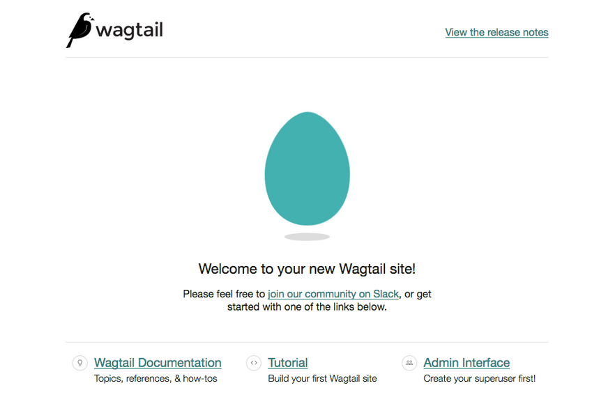

**Last updated 11th February 2022.**

## Objective

[Wagtail](https://wagtail.org/){.external} is a free and open source content management system (CMS) written in Python. It is popular amongst websites using the [Django framework](https://www.djangoproject.com/){.external}.

In this tutorial, we are going to show you how to install [Wagtail](https://wagtail.org/){.external} and how to connect it to the OVHcloud managed [PostgreSQL](https://www.postgresql.org/){.external} database [service](https://www.ovhcloud.com/en-gb/public-cloud/postgresql/).

## Requirements

- Access to the [OVHcloud Control Panel](https://www.ovh.com/auth/?action=gotomanager&from=https://www.ovh.de/&ovhSubsidiary=de).
- A [Public Cloud project](https://www.ovhcloud.com/de/public-cloud/) in your OVHcloud account.
- An up and running Public Cloud Database for PostgreSQL.
- A Python environment with a stable version and public network connectivity (Internet). This tutorial was made using Python 3.9.7.

> [!primary]
>
> Wagtail supports Python 3.7, 3.8, 3.9 and 3.10.
>  

## Instructions

> [!primary]
>
> Before installing Wagtail, it is necessary to install the libjpeg and zlib libraries, which provide support for working with JPEG, PNG and GIF images (via the Python Pillow library).
>

### Create and activate a virtual environment

```bash
$ python3 -m venv mysite/env
$ source mysite/env/bin/activate
```

> [!primary]
>
> If you’re using version control (e.g. git), mysite will be the directory for your project. The env directory inside of it should be excluded from any version control.
>

### Install Wagtail

Use pip, which is packaged with Python, to install Wagtail and its dependencies:

```bash
$ pip install wagtail
```

### Generate your site

Wagtail provides a start command similar to django-admin startproject. Running wagtail start mysite in your project will generate a new mysite folder with a few Wagtail-specific extras, including the required project settings, a “home” app with a blank HomePage model and basic templates, and a sample “search” app.

Because the folder mysite was already created by venv, run wagtail start with an additional argument to specify the destination directory:

```bash
$ wagtail start mysite mysite
```

### Install project dependencies

```bash
$ cd mysite
$ pip install -r requirements.txt
```

### Create the database

Before creating the database, let's edit the `mysite/mysite/settings/base.py` file and adapt the connection parameters to the database

The useful parameters are:

- The db Host, the db Port
    - Get them from the "General Information tab"
- The db Name
    - Get it from the "Databases" tab, usually "defaultdb"
- The db User
    - Get it from the "Users" tab, usually "avnadmin"
- The db Password
    - Get it after you reset it.

{.thumbnail}

```python
DATABASES = {
    'default': {
        'ENGINE': 'django.db.backends.postgresql',
        'NAME': <db_name>,
        'USER': <username>,
        'PASSWORD': <password>,
        'HOST': <host>,
        'PORT': <port>,
        'OPTIONS': {
          'sslmode': 'require'
        }
    }
}
```

The create the database :

```bash
$ python manage.py migrate
```

This command ensures that the tables in your database are matched to the models in your project. Every time you alter your model (eg. you may add a field to a model) you will need to run this command in order to update the database.

### Create an admin user

When logged into the admin site, a superuser has full permissions and is able to view/create/manage the database.

```bash
$ python manage.py createsuperuser
```

### Start the server

```bash
$ python manage.py runserver
```

If everything worked, http://127.0.0.1:8000 will show you a welcome page:

{.thumbnail}

### Cleaning up

To clean your Wagtail, make sure it is closed by pressing `CTRL+C`{.action} in the terminal you used to launch it, then delete your installation folder.

```sh
rm -rf /home/my/app/path/my-wagtail/
```

To clean your PostgreSQL, use the OVHcloud Control Panel to delete your managed PostgreSQL service:

{.thumbnail}

## We want your feedback!

We would love to help answer questions and appreciate any feedback you may have.

Are you on Discord? Connect to our channel at <https://discord.gg/PwPqWUpN8G> and interact directly with the team that builds our databases service!
